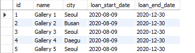

# Business Data Management [BDM]     
# Spring 2020    
# Homework Assignment #5: Final Assignment       
**Student Name:**  MD. FAZLAY RABBY     
**Student ID:**  18200610     

# Part 1: Identify key components of the data model (60 points).     

### 1) Entities and attributes        
* `arts: id, item_code, title, type, size`
* `artists: artist_id, name, date_of_birth, date_of_death`
* `artist_art: artist_id, art_id`
* `museums: id, location_in_museum`
* `traveling_shows: id, city, traveling_show_start_date, traveling_show_end_date`
* `another_galleries: id, name, city, loan_start_date, loan_end_date      `
* `art_presence: id, art_id, art_presence( 'display_at_the_museum', 'held_in_storage', 'traveling_show', 'loan_to_another_gallery' ), museum_id, traveling_show_id, another_gallery_id`

### 2) Identify relationships including the degree and cardinality of each relationship. 

a. `arts & artists` this relationship is a degree of 2 (binary). The cardinality is
Many-to-Many between `arts` & `artists`. One arts can belongs to a artist and artist can have multiple art work.
In some case, one cart could developed by list of artist. we use `artist_art` pivot table 

b. `art_presence, artists, museums, traveling_shows, another_galleries`: this relationship is a degree of N-ary (n degree). The cardinality is
(Mandatory)One-to-(Optional)One from arts to art_presence. Others cardinalities are (Optional)One-to-(Optional)One from `art_presence` to `museums`, `traveling_shows` & `another_galleries` .  

# Part 2: Create a [logical] database schema based on your answers in Part 1 using MySQL Workbench (40 points).   

          

# Part 3: Develop a [physical] database on your MySQL server based on the database schema created in Part 2, and then insert data into each table. (50%)

#### `arts` Table
          

#### `artists` Table
          

#### `artist_art` Table
          

#### `museums` Table
          

#### `traveling_shows` Table
          

#### `another_galleries` Table
          

#### `art_presence` Table
          

# Part 4: Prepare and run SELECT statements for the following queries (30%)

2) List titles and types of artworks that were developed by ‘John Smith’ and participated in a show held in ‘Seoul’.
3) List artwork names and names of galleries where artworks developed by ‘John Smith’ are loaned.
Part 1 and other table(s). 

### 1) List titles and types of artworks that were developed by ‘John Smith’.        
**Sql query**        
~~~sql
select arts.title as title, arts.type as type
from artist_art
join artists on artists.id = artist_art.artist_id
join arts on arts.id = artist_art.art_id
where artists.name = 'John Smith';
~~~       

**Output Result**  
      

### 2) List titles and types of artworks that were developed by ‘John Smith’ and participated in a show held in ‘Seoul’.
    
**Sql query**        
~~~sql
select arts.title as title, arts.type as type
from artist_art
join artists on artists.id = artist_art.artist_id
join arts on arts.id = artist_art.art_id
join art_presence on art_presence.art_id = artist_art.art_id
join traveling_shows on traveling_shows.id = art_presence.traveling_show_id
where ( 
  artists.name = 'John Smith' and 
  traveling_shows.city = 'Seoul'
);
~~~       

**Output Result**  
      

### 3) List artwork names and names of galleries where artworks developed by ‘John Smith’ are loaned.       
**Sql query**        
~~~sql
select arts.title as artwork_name, another_galleries.name as gallery_name
from artist_art
join artists on artists.id = artist_art.artist_id
join arts on arts.id = artist_art.art_id
join art_presence on art_presence.art_id = artist_art.art_id
join another_galleries on another_galleries.id = art_presence.another_gallery_id
where  
artists.name = 'John Smith';
~~~      

**Output Result**  
      

### 4) Count the number of artworks developed by ‘John Smith’. (Note: use COUNT() to count rows.)
      
**Sql query**        
~~~sql
select artists.name as artist_name, count(artists.name) as number_of_art_work
from artist_art
join artists on artists.id = artist_art.artist_id
join arts on arts.id = artist_art.art_id
where artists.name = 'John Smith'
GROUP BY 1;
~~~    

**Output Result**  
      

### 5) List artist names and the number of artworks developed by each artist.
      
**Sql query**        
~~~sql
select artists.name as artist_name, count(*) as number_of_art_work
from artist_art
join artists on artists.id = artist_art.artist_id
join arts on arts.id = artist_art.art_id
GROUP BY 1;
~~~      

**Output Result**  
      

### 6) Create your own query that involves the table(s) transformed from the entity or entities that you added in
      
**Sql query**        
~~~sql
select
  arts.title as art_title,
  arts.type as art_type,
  artists.name as artist_name,
  art_presence.art_presence as art_presence
from artist_art
left join artists on artists.id = artist_art.artist_id
left join arts on arts.id = artist_art.art_id
left join art_presence on art_presence.art_id = artist_art.art_id
limit 10;       
~~~      

**Output Result**  
      

